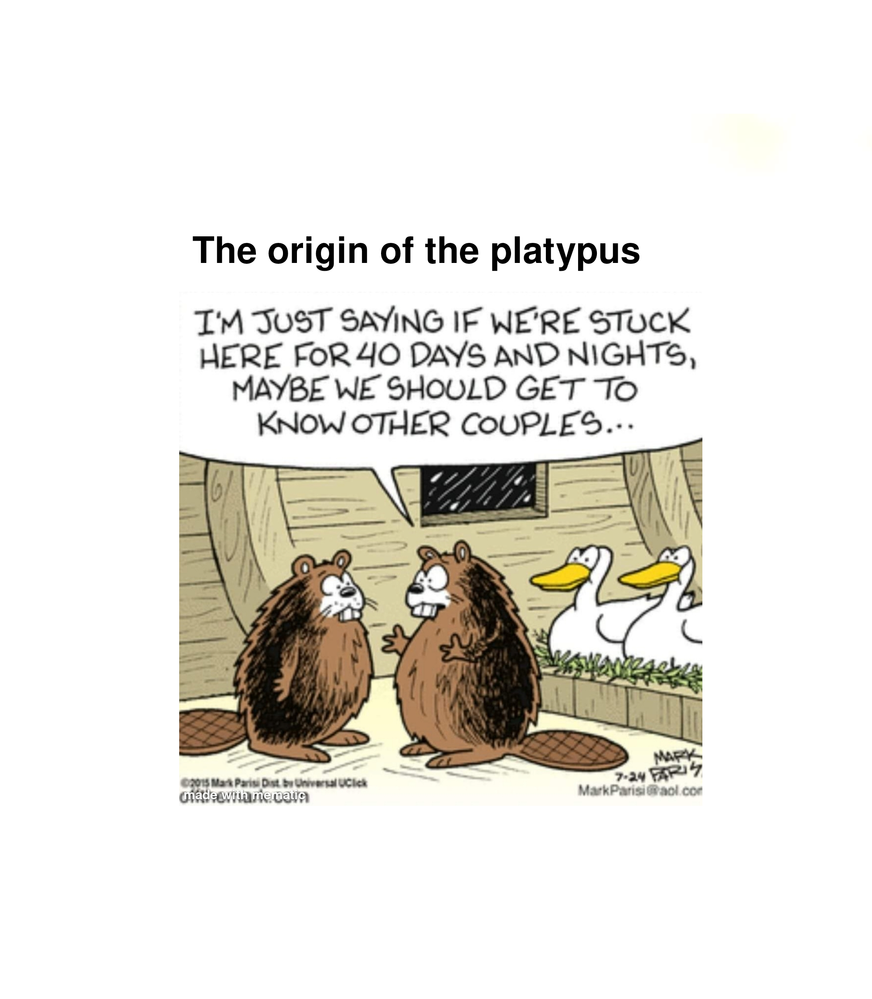

# ... to making our own organism from scratch?

**March 25, 2025**
**By Tuhin Kumar Raut**

Imagine a world where we could custom-design organisms to our exact specifications. It seems like a fever dream, but the reality of how close we are might shock you.

Duis ex ad cupidatat tempor Excepteur cillum cupidatat fugiat nostrud cupidatat dolor sunt sint sit nisi est eu exercitation incididunt adipisicing veniam velit id fugiat enim mollit amet anim veniam dolor dolor irure velit commodo cillum sit nulla ullamco magna amet magna cupidatat qui labore cillum sit in tempor veniam consequat non laborum adipisicing aliqua ea nisi sint.
